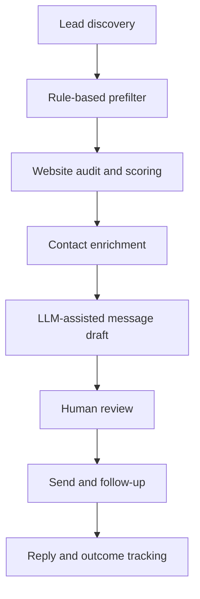

# OutreachAgent — AI-assisted GTM workflow

Public, privacy-safe case study of a private production system for B2B lead research, website analysis, qualification, enrichment, personalized outreach, and follow-up.

The production repository and live database remain private because they contain proprietary workflow logic and real business contact data. This repository documents the architecture and includes a small, runnable Python demo built only with synthetic data.

## Why I built it

Manual B2B prospecting is fragmented: finding companies, checking their websites, qualifying opportunities, researching contacts, preparing messages, reviewing them, and tracking follow-ups usually happens across several tools and spreadsheets.

I designed OutreachAgent to turn those steps into one controlled pipeline while keeping a human review gate before any outbound action.

## What the private system does



- Discovers local businesses through the Google Maps APIs.
- Deduplicates records and applies inexpensive filters before paid API calls.
- Audits websites and combines technical and commercial signals into a score.
- Uses a waterfall approach for contact enrichment.
- Generates personalized drafts with LLM APIs and deterministic guardrails.
- Requires explicit approval before live sending.
- Tracks states, replies, follow-ups, costs, provider limits, and operational health.

Documented snapshots contain roughly 5,900 business records. Exact live figures are intentionally not presented as current because the production database is separate from GitHub.

## Technology and engineering decisions

| Area | Implementation |
|---|---|
| Application | Python 3.13, Flask, CLI tooling |
| Persistence | SQLite with WAL mode, migrations, and serialized background writes |
| Integrations | REST APIs, Google Maps, PageSpeed, LLM providers, email services |
| Automation | Scheduled pipelines, retries/backoff, provider and budget limits |
| Safety | Human review, explicit live-send confirmation, secret isolation, PII excluded from Git |
| Delivery | Git/GitHub, terminal workflows, Ubuntu VPS deployment |
| AI-assisted development | Claude Code and Codex used to implement, test, review, and iterate from requirements |

I owned the workflow design, requirements, integration decisions, evaluation, and deployment. Coding agents accelerated implementation, but their output was reviewed against tests, operational constraints, and observed system behavior.

## Public demo

The demo reproduces a small privacy-safe slice of the workflow:

1. load synthetic business records;
2. remove duplicates and out-of-scope records;
3. calculate an explainable opportunity score;
4. route qualified records to human review;
5. export structured JSON results.

Run it with:

```bash
python -m src.demo_pipeline samples/leads.json --output demo_output.json
python -m unittest discover -s tests -v
```

The demo uses only the Python standard library and performs no network calls or message sending.

## What this project demonstrates

- Translating a commercial workflow into a stateful software system.
- Writing Python automation that integrates APIs and handles failures and limits.
- Using AI coding agents beyond chat while retaining human ownership and review.
- Designing for cost control, data protection, observability, and safe execution.
- Iterating from real operational feedback instead of treating a prototype as finished.

## Current status and limits

OutreachAgent has been used in controlled outreach tests and produced replies. The available sample is not sufficient to claim validated commercial performance, so I present it as evidence of workflow engineering and technical execution rather than product-market fit.

The public demo is intentionally simplified. It contains no production credentials, databases, lead identities, email content, infrastructure details, or proprietary scoring thresholds.

## About me

I'm Francesco Villari, a Management Engineering graduate starting an MSc in Smart Industry Engineering. I am developing practical skills in Python, data, AI-assisted automation, industrial processes, and digital transformation.

- [LinkedIn](https://www.linkedin.com/in/francesco-villari/)
- [GitHub](https://github.com/Villarischiuz)
